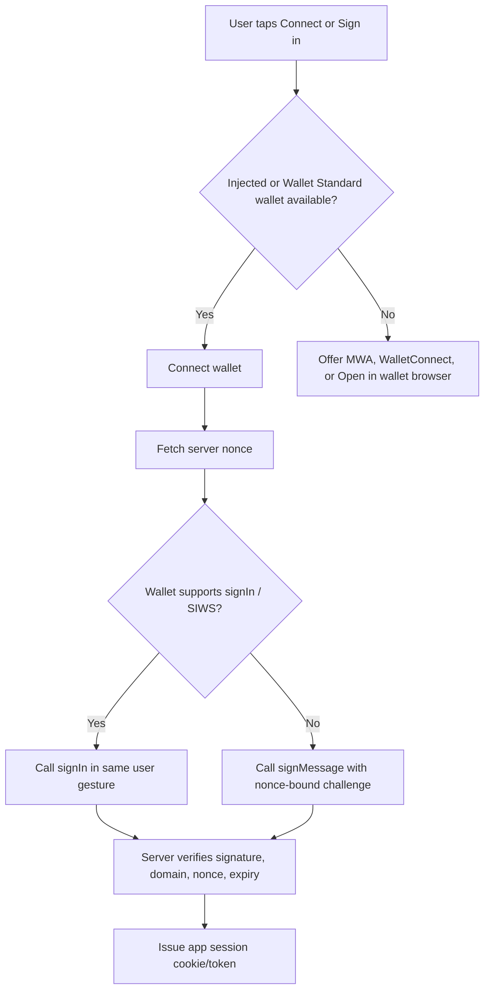
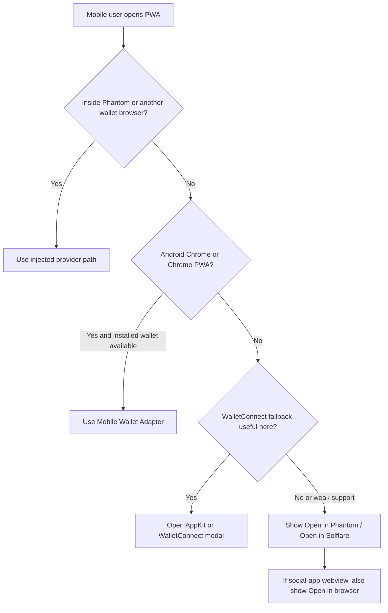

# Mobile Wallet Integration for an Expo React Native PWA on Solana

## Executive summary

For an Expo React Native app that ships as a web build/PWA, the durable strategy is not a single SDK. It is a layered wallet access stack: use Solana Wallet Adapter or Wallet Standard for injected wallets inside wallet browsers, add Solana Mobile Wallet Adapter for Android Chrome and Chrome-installed PWAs, add wallet-specific deep links and universal links to open the page inside Phantom or Solflare when the user is in a non-wallet browser, and add WalletConnect v2 only as an optional fallback for wallets that actually implement Solana/SVM methods. That stack matches the current platform reality: Phantom injects a provider into its mobile in-app browser on secure origins, Solana Mobile Wallet Adapter works on Android Chrome and Chrome PWAs but not iOS, and deeplinks are the official mobile-native bridge for Phantom and Solflare. citeturn6search5turn8search0turn2search1turn2search3turn28search4turn28search21

For Phantom mobile browser specifically, the best path is the simplest one: if the PWA is opened inside Phantom’s browser, use the injected provider or Wallet Standard path first. Do not force WalletConnect or a deeplink when direct injection already exists. Phantom’s docs are explicit that the extension and the mobile in-app browser inject `window.phantom` / `window.solana` on `https://`, `localhost`, or `127.0.0.1`, and not inside iframes or insecure origins. citeturn8search0turn7search0

Expo-specific constraints matter because Expo Router web builds are static by default. Browser APIs such as `window.location` are unavailable during static rendering, and web auth in Expo Router is client-side by default unless you deploy server output or an external backend. In practice, that means wallet detection, provider access, local storage reads, and deeplink return handling must be client-only, usually via `.web.tsx` files, lazy imports, or `useEffect`. If you want secure server-issued nonces, cookie sessions, or callback verification inside the same codebase, you need `web.output: "server"` with API routes or an external API. citeturn24search1turn24search0turn24search4turn24search6

Social and embedded authentication flows are the weakest part of the mobile-web story when the page is opened inside third-party in-app browsers such as apps like entity["company","Facebook","social media platform"] and entity["company","Instagram","social media platform"]. The right operating assumption is “embedded webview behavior until proven otherwise”: deeplinks may require an explicit tap, redirects may be unreliable, and OAuth may fail entirely because entity["company","Google","technology company"] explicitly blocks OAuth in embedded webviews and OAuth best practice for native/mobile contexts rejects embedded user-agents. Your fallback UI therefore needs a hard “Open in browser” or “Open in wallet” escape hatch. citeturn5search1turn26search0turn26search3turn26search5turn26search23

## Recommended architecture and library choices

The most pragmatic baseline for a Solana-centric PWA is still `@solana/wallet-adapter-react` plus `@solana/wallet-adapter-wallets`, with direct wallet-browser support from Phantom and Solflare, plus `@solana-mobile/wallet-standard-mobile` for Android Chrome/PWA installed-wallet support. The Solana Cookbook still documents Wallet Adapter as the standard React path, the wallet-adapter repo continues to expose legacy adapters through `@solana/wallet-adapter-wallets`, and Solana Mobile’s web docs state that Android Chrome and Chrome PWAs can integrate Mobile Wallet Adapter automatically when using `@solana/wallet-adapter-react`. citeturn31search4turn31search5turn2search1turn2search3

If you are starting greenfield in 2026 and want a more Wallet-Standard-first stack, `@solana/connector` is the strongest modern alternative. ConnectorKit describes itself as a production-ready, Wallet Standard-first connector with React hooks, a headless core, built-in Solana Mobile Wallet Adapter support, support for both `@solana/web3.js` and `@solana/kit`, and a companion debugger. The tradeoff is maturity: it is newer than wallet-adapter, with fewer examples and less accumulated community troubleshooting. citeturn22view0turn23search18turn23search19

For WalletConnect v2 and long-tail wallet fallback, use either `@reown/appkit` with `@reown/appkit-adapter-solana` or the lower-level `@walletconnect/solana-adapter`. AppKit’s React docs install Solana via `@reown/appkit` plus `@reown/appkit-adapter-solana` and recommend configuring the modal outside React components. Reown’s Solana adapter docs explicitly position `@walletconnect/solana-adapter` as the bridge into Solana Wallet Adapter. The downside is not the library; it is wallet support. Reown’s own docs warn that not every mainstream wallet supports Solana through WalletConnect, so WalletConnect must stay a fallback, not your only path. citeturn32search3turn12search0turn12search1turn12search10

For Phantom-specific onboarding, social login, or embedded wallet UX, the official Phantom Browser SDK or React SDK is the cleanest supported route. Phantom’s docs explicitly say the Browser SDK is suited to PWAs and supports `google`, `apple`, `phantom`, `injected`, and `deeplink` providers under one interface, while the React SDK provides the same capabilities as React hooks. That is valuable if Phantom is strategically important to your product. It is not a substitute for broad wallet coverage, because it is still Phantom-specific by design even when it offers a unified API. citeturn29search1turn29search4turn29search5turn29search6turn33search0turn33search1

The package choices below are the ones worth taking seriously now.

| Role | Package(s) | Recommended release line | Why it belongs | Main downside |
|---|---|---|---|---|
| Baseline Solana web wallet support | `@solana/wallet-adapter-react`, `@solana/wallet-adapter-react-ui`, `@solana/wallet-adapter-wallets`, `@solana/web3.js` | `0.15.x`, `0.9.x`, `0.19.x`, `1.98.x` respectively. citeturn31search0turn31search9turn31search6turn3search2 | Broad examples, direct support for injected wallets, still the default React pattern in Solana docs. citeturn31search4turn31search5 | Older ergonomics; mobile fallbacks are not automatic unless you add them. |
| Android installed-wallet mobile web | `@solana-mobile/wallet-standard-mobile` | `0.5.x`. citeturn4search2 | Official way to expose Mobile Wallet Adapter on Android Chrome and Chrome PWAs. citeturn2search1turn2search3 | No iOS support; no Firefox/Brave/Opera support. citeturn2search1turn2search3 |
| WalletConnect / multichain fallback | `@reown/appkit` + `@reown/appkit-adapter-solana` or `@walletconnect/solana-adapter` | `1.8.x` for AppKit/AppKit Solana adapter, `0.0.8` for WalletConnect Solana adapter. citeturn32search0turn32search2turn20search4 | Best optional fallback for non-injected or multichain wallets; official redirect/mobile docs are strong. citeturn12search0turn12search1turn5search1 | Requires a project ID; Solana support depends on the wallet, not just the protocol. citeturn12search0turn12search10 |
| Phantom-first embedded/social login | `@phantom/browser-sdk` or `@phantom/react-sdk` | `1.0.7`. citeturn33search0turn33search1 | Official Phantom-supported path for PWAs, injected connections, Phantom Login, Google/Apple auth, and deep links. citeturn29search1turn29search4turn29search5 | Phantom-centric; not a broad multi-wallet solution. |
| Future-oriented Solana connector | `@solana/connector` | `0.2.x`. citeturn23search18 | Wallet Standard-first, MWA built in, debugger available, modern headless architecture. citeturn22view0 | Newer ecosystem; fewer tutorials and integrations than wallet-adapter. |

Two packages should not be part of a new implementation. `@phantom/wallet-sdk` is deprecated and Phantom directs developers to the new Browser/React/React Native SDKs instead. `web3modal` is also deprecated in favor of Reown AppKit. citeturn33search7turn33search10

## Compatibility matrix

The table below is the operational matrix that matters most for a mobile Expo web/PWA deployment.

| Wallet / class | Protocols worth supporting | Expected behavior when page is opened inside Phantom mobile browser | Expected behavior in common social-app in-app browsers | Practical recommendation |
|---|---|---|---|---|
| Phantom mobile | Injected provider / Wallet Standard in Phantom browser; Phantom Browser or React SDK; Phantom deeplinks and universal links. citeturn6search5turn8search0turn29search4turn29search0turn28search4 | Best case. Phantom injects `window.phantom` / `window.solana` on secure origins, so connect, signMessage, and transaction methods should work directly. It will not inject in iframes or `http://`. citeturn8search0turn7search0turn8search8turn8search9 | Usually no injected provider. Treat these environments as embedded webviews; expect deeplink/OAuth problems and route the user to “Open in Phantom” or “Open in browser”. citeturn5search1turn26search0turn26search3 | Tier-one target. Optimize this path first. |
| Solflare | Injected provider in Solflare mobile browser; Solana Wallet Adapter integration; Solflare deeplinks/universal links. citeturn14search1turn14search4turn14search10turn14search3 | No Solflare injection inside Phantom browser. If user wants Solflare from Phantom browser, you need a wallet-switch path such as a Solflare deeplink or an optional WalletConnect/AppKit path if the wallet supports it. citeturn14search2turn14search3turn12search0 | Like Phantom, assume no injection and offer “Open in Solflare” or “Open in browser”. Solflare’s `browse` deeplink is purpose-built for this. citeturn14search2turn14search10 | Tier-two target. Provide explicit Solflare open/browse fallback. |
| Slope | Primary official mobile-web integration docs did not surface in this review. Current protocol support is therefore lower-confidence. | No native benefit from Phantom browser context. Any support would depend on Slope’s own browser or an external protocol path you validate yourself. | Assume poor or unknown behavior until tested on real devices. | Do not treat Slope as a launch-critical target without direct device validation and current first-party docs. |
| Sollet | Legacy web wallet / developer tool; not a modern maintained mobile-wallet-browser target. The official repo says it is a developer tool and recommends Backpack for wallet use; keys are stored in `localStorage`. citeturn18search7 | No meaningful path inside Phantom browser beyond generic browser behavior. | Poor fit for modern mobile-web support. | Do not optimize for Sollet except legacy-account recovery cases. |
| WalletConnect-compatible wallets | Use Reown AppKit or `@walletconnect/solana-adapter` only for wallets that actually expose Solana/SVM methods. citeturn12search1turn12search0turn5search8 | Inside Phantom browser, direct Phantom injection is still superior. WalletConnect is a fallback, not the primary route. citeturn8search0turn12search1 | Can work, but only if the in-app browser allows the deeplink/universal-link handoff and the selected wallet supports Solana over WalletConnect. citeturn5search1turn11search5turn12search10 | Useful optional fallback for long-tail wallets and multichain products. Not sufficient alone for Solana mobile web. |

There is a brutal but accurate takeaway: on Solana mobile web today, iOS and non-Chrome Android browsers do not get Mobile Wallet Adapter, so your realistic winning paths are wallet-browser injection, wallet-specific deeplinks, or WalletConnect where the selected wallet truly supports Solana. That is the constraint set your UX has to respect. citeturn2search1turn2search3turn2search4turn17search17

## Expo web implementation patterns

The safest Expo web pattern is to isolate wallet code to web-only modules and keep anything that touches `window`, local storage, or deeplink return parsing out of static-rendered code. Expo’s static rendering docs explicitly state that browser APIs are unavailable during static rendering, and Expo Router’s web auth docs say client-side redirects are the default on static web builds. citeturn24search1turn24search0turn24search2

A solid baseline provider for an Expo PWA looks like this. It keeps you on the official Solana path, leaves room for Mobile Wallet Adapter on Android Chrome/PWA, and avoids prematurely coupling the whole app to Phantom-only APIs. The key structural point is the file boundary: make this a `.web.tsx` module and import it only from web-rendered code.

```tsx
// src/wallet/SolanaProvider.web.tsx
import { PropsWithChildren, useMemo } from "react";
import { clusterApiUrl, Connection } from "@solana/web3.js";
import { WalletAdapterNetwork } from "@solana/wallet-adapter-base";
import { ConnectionProvider, WalletProvider } from "@solana/wallet-adapter-react";
import { WalletModalProvider } from "@solana/wallet-adapter-react-ui";
import {
  PhantomWalletAdapter,
  SolflareWalletAdapter,
} from "@solana/wallet-adapter-wallets";

// Registers Android Mobile Wallet Adapter on supported browsers.
import "@solana-mobile/wallet-standard-mobile";

// Import CSS only from web code.
import "@solana/wallet-adapter-react-ui/styles.css";

export function SolanaProvider({ children }: PropsWithChildren) {
  const network = WalletAdapterNetwork.Mainnet;
  const endpoint = clusterApiUrl(network);

  const wallets = useMemo(
    () => [
      new PhantomWalletAdapter(),
      new SolflareWalletAdapter(),
      // Add WalletConnect only if you want a separate fallback path.
    ],
    []
  );

  return (
    <ConnectionProvider endpoint={endpoint}>
      <WalletProvider wallets={wallets} autoConnect>
        <WalletModalProvider>{children}</WalletModalProvider>
      </WalletProvider>
    </ConnectionProvider>
  );
}
```

This baseline remains aligned with official Solana guidance, and Solana Mobile’s docs say Android Chrome and Chrome PWAs are the supported mobile-web environment for installed-wallet discovery. If one of these libraries touches `window` at import time in your build, move the module behind a client-only dynamic import rather than fighting the render pipeline. citeturn31search4turn2search1turn2search3turn24search1

When you want a Phantom-first path, especially for embedded/social login or a single unified API across injected and mobile-deeplink modes, use the Browser SDK in a separate integration path rather than replacing your full multi-wallet layer with it. Phantom explicitly positions the Browser SDK as appropriate for PWAs and exposes a `provider` model covering `injected`, `deeplink`, `google`, `apple`, and `phantom`. citeturn29search1turn29search4turn29search6turn33search18

```ts
// src/wallet/phantom.ts
import { AddressType, BrowserSDK } from "@phantom/browser-sdk";

export const phantomSdk = new BrowserSDK({
  providers: ["injected", "deeplink", "google", "apple", "phantom"],
  addressTypes: [AddressType.solana],
  appId: process.env.EXPO_PUBLIC_PHANTOM_APP_ID, // required for embedded providers
});

export async function connectPhantomInjectedFirst() {
  // Choose provider based on environment / UI
  return phantomSdk.connect({ provider: "injected" });
}

export async function signMessageWithPhantom(message: string) {
  return phantomSdk.solana.signMessage(message);
}
```

For non-wallet browsers, the highest-leverage fallback is not another modal. It is a direct “Open in Phantom” and “Open in Solflare” action using official browse deeplinks. Both Phantom and Solflare document `browse` deeplinks that can open a web page directly in the wallet’s in-app browser before any wallet session exists. Trigger them from a user tap, not automatically on page load. citeturn28search9turn14search2turn5search1

```ts
export function openInPhantom() {
  const url = encodeURIComponent(window.location.href);
  window.location.href = `https://phantom.app/ul/v1/browse/${url}`;
}

export function openInSolflare() {
  const url = encodeURIComponent(window.location.href);
  const ref = encodeURIComponent(window.location.origin);
  window.location.href = `https://solflare.com/ul/v1/browse/${url}?ref=${ref}`;
}
```

If you do want WalletConnect/AppKit as a long-tail or multichain fallback, keep the config outside React components exactly as Reown recommends, and treat it as a secondary route behind direct injection and wallet-browser opening. Also do not hide the “All Wallets” path on mobile if you actually want long-tail mobile wallets to remain reachable. citeturn12search0turn12search3turn5search4

```ts
// src/wallet/appkit.ts
import { createAppKit } from "@reown/appkit/react";
import { SolanaAdapter } from "@reown/appkit-adapter-solana/react";
import { solana } from "@reown/appkit/networks";

const projectId = process.env.EXPO_PUBLIC_REOWN_PROJECT_ID!;

createAppKit({
  adapters: [new SolanaAdapter()],
  networks: [solana],
  projectId,
  metadata: {
    name: "Your PWA",
    description: "Solana wallet connection",
    url: "https://app.example.com",
    icons: ["https://app.example.com/icon.png"],
  },
  enableReconnect: true,
  enableMobileFullScreen: true,
});
```

## Authentication, signing, and session design

Connection is not authentication. A wallet connect event proves only that a provider is present and the user approved account access. Real authentication requires a signed challenge with a nonce, an expiry, your domain, and ideally a standards-based message format. Phantom supports Sign-In With Solana, and Solana Mobile’s guidance for web explicitly recommends using `signIn()` where available on Android/MWA because `connect()` plus a later programmatic `signMessage()` can violate Chrome’s trusted-event navigation policy. citeturn8search9turn19search0turn19search1turn2search2

For a PWA, the clean auth model is this: issue a nonce from your backend or API route, have the wallet sign a standards-based message in the same user interaction, verify server-side, then mint your own application session cookie or token. Do not let the wallet session itself become your app session model. Expo Router’s static-web model does not give you secure request-time auth semantics by default, so if you need same-origin cookie issuance and callback handling inside Expo itself, use server output plus API routes or an external backend. citeturn24search0turn24search4turn24search6



For transaction signing, keep the distinction between injected-provider behavior and deeplink behavior straight. In Phantom’s injected/web provider docs, `signAndSendTransaction()` is still the simplest recommended path for web usage. In Phantom’s deeplink docs, however, `signAndSendTransaction` is deprecated, and Phantom advises using `signTransaction` or `signAllTransactions` instead. For deeplink flows, that means you usually sign, return to the PWA, and broadcast yourself through RPC. Solflare’s deeplink docs follow the same basic pattern of `connect` → session token → encrypted sign method → app-side broadcast where appropriate. citeturn8search8turn28search17turn6search3turn6search12turn14search5turn14search0turn28search15

Phantom Connect has its own session logic as well. If you use Phantom embedded/social login, Phantom says sessions remain active for seven days since the last login, embedded wallets created through social login are non-custodial from the app’s perspective, and your app must be registered in Phantom Portal with allowed domains and redirect URLs. That is convenient, but it is still a product-specific session and should not replace your own authorization model. citeturn29search5turn29search0turn29search7

## Security, fallback strategy, and mobile UX

For deep links, the security baseline is non-negotiable: protect redirect routes, treat session tokens as sensitive, validate returned data, and never hand-roll plaintext deeplink payloads when the wallet expects encrypted ones. Both Phantom and Solflare document end-to-end encrypted deeplink payloads using a Diffie-Hellman-derived shared secret and nonce-based encryption, with a session token returned at connect time and reused for subsequent provider calls. citeturn28search0turn28search1turn28search8turn28search2turn28search7

Redirect-link choice depends on the surface. For a native mobile app, custom schemes are usually what you want. For a web PWA, HTTPS callback URLs are usually the right return path because you want the user back in the browser. Phantom explicitly notes the tradeoff: HTTPS redirects show app metadata properly but open in the mobile browser, while custom schemes return to the native app but do not show app metadata in the approval dialog. For your current Expo web/PWA surface, prefer HTTPS callbacks for wallet deeplinks and reserve custom schemes for future native builds. citeturn6search11turn28search25

In mobile UX terms, the correct flow is context-sensitive routing, not a universal wallet modal. If the page is already inside Phantom mobile browser, connect directly and skip the wallet chooser. If the environment is Android Chrome or an installed Chrome PWA and Mobile Wallet Adapter is available, prefer the installed-wallet path and keep connect plus sign-in in one user action. If neither condition is true, show explicit actions: “Open in Phantom,” “Open in Solflare,” “More wallets,” and “Open in browser.” Solana Mobile’s UX guide even recommends renaming the MWA option to “Use Installed Wallet,” which is materially clearer to end users than exposing protocol jargon. citeturn2search2turn2search3turn8search0turn14search2



You should also assume that social login in third-party in-app browsers is fragile even when the wallet path itself is sound. Google’s policy blocks OAuth in embedded webviews, and OAuth best practice for native/mobile contexts rejects embedded user-agents because of security and session-sharing problems. So if you offer Phantom Connect with `google` or `apple` providers in a PWA, gate those options by browser context and fall back to “Open in browser” when the page came from a social-app webview. citeturn26search0turn26search3turn26search5turn26search23turn29search5

## Implementation pitfalls and debugging

The first class of failures is build-time and render-time, not wallet-time. On Expo web, static rendering means `window` is unavailable during render, so any wallet library that assumes browser globals during module evaluation can break the build or hydration. Keep wallet code in web-only files and move fragile imports behind client-only boundaries if necessary. citeturn24search1turn24search0

The second class of failures is origin and embedding. Phantom injection requires a secure origin and will not work in iframes. If your app lives inside someone else’s embedded frame or you test on a plain `http://` preview, you are debugging a setup the wallet explicitly does not support. citeturn8search0

The third class of failures is assuming “mobile web” means a single platform. It does not. Solana Mobile Wallet Adapter is Android-only today and Chrome-only on the web side; iOS gets no MWA support in any browser, and Android Firefox/Opera/Brave are also unsupported. If you miss this, you will waste days chasing nonexistent bugs. citeturn2search1turn2search3turn2search4

The fourth class of failures is overtrusting WalletConnect coverage. Reown’s documentation makes clear that AppKit and the WalletConnect protocol can support Solana, but wallet-level support is still selective. Do not infer “listed in a wallet explorer” from “supports Solana signing methods in your flow.” Validate the exact wallet matrix you plan to market. citeturn12search1turn12search10

The fifth failure is using deprecated paths because old blog posts still rank. Phantom’s old `@phantom/wallet-sdk` is deprecated. `web3modal` is deprecated. Phantom deeplink `signAndSendTransaction` is deprecated. Sollet’s official repo says it is a developer tool and stores keys in `localStorage`, which is enough by itself to disqualify it from a modern primary mobile-wallet target. citeturn33search7turn33search10turn28search17turn18search7

For debugging, Phantom now documents a real mobile-web debugging path: turn on Web View Debugging in Phantom mobile, then inspect the page from desktop Safari on iOS or Chrome DevTools on Android. If you adopt ConnectorKit, the `@solana/connector-debugger` package gives you connection state, wallet info, event streams, and transaction tracking directly in development. Those two tools combined are enough to stop guessing. citeturn10search0turn22view0

One limitation of this review is Slope. I did not surface current primary developer documentation for modern PWA/mobile-browser integration comparable to Phantom or Solflare. That does not prove Slope cannot work; it means you should not market or architect around Slope compatibility until you test it yourself on real devices and confirm a maintained integration path.

## Actionable integration checklist

1. **Adopt a layered protocol plan, not a single SDK.** Use Wallet Adapter or Wallet Standard for injected wallets, add `@solana-mobile/wallet-standard-mobile` for Android Chrome/PWA, add wallet-browser deeplinks for Phantom and Solflare, and add Reown/AppKit only as a fallback. citeturn31search4turn2search3turn28search9turn14search2turn12search0  
2. **Put wallet logic in web-only boundaries.** Use `.web.tsx`, avoid browser globals during static render, and import wallet UI CSS only from web code. If you need secure callback verification or cookie sessions, enable Expo `web.output: "server"` plus API routes or use an external backend. citeturn24search1turn24search0turn24search4  
3. **Make Phantom mobile browser the primary happy path.** When `window.phantom?.solana?.isPhantom` exists, connect directly and skip the wallet picker. Require `https` and do not test inside iframes. citeturn8search0turn7search0  
4. **Add Android installed-wallet support deliberately.** If MWA is present, select it early and keep connect plus auth signing in one user gesture. Label it as “Use Installed Wallet,” not “MWA.” citeturn2search2turn2search3  
5. **Treat WalletConnect as optional fallback, not default.** Configure AppKit outside React components, keep the mobile “All Wallets” path visible if you need long-tail support, and validate actual Solana wallet coverage before shipping claims. citeturn12search0turn5search4turn12search10  
6. **Implement nonce-based auth.** Use SIWS or a wallet-signed challenge with domain, nonce, URI, and expiry. Verify server-side and mint your own app session. Never treat `connect()` alone as login. citeturn19search0turn19search1turn8search9turn24search4  
7. **Separate injected/web and deeplink transaction paths.** For injected Phantom web, `signAndSendTransaction()` is fine. For Phantom deeplinks, use `signTransaction` or `signAllTransactions` and broadcast yourself because deeplink `signAndSendTransaction` is deprecated. citeturn8search8turn6search3turn6search12turn28search17  
8. **Provide explicit mobile escape hatches.** Add visible buttons for “Open in Phantom,” “Open in Solflare,” and “Open in browser,” especially when the page is opened from a social-app in-app browser. Do not auto-fire these redirects on page load. citeturn28search9turn14search2turn5search1turn26search0  
9. **Debug on real devices, not only desktop emulation.** Use Phantom mobile Web View Debugging plus desktop Safari/Chrome inspection, and layer ConnectorKit debugger or equivalent event logging on top. citeturn10search0turn22view0  
10. **Do not overpromise Slope or Sollet support.** Sollet is legacy. Slope support is lower-confidence in this review because current first-party integration docs did not surface. Verify before you advertise compatibility. citeturn18search7